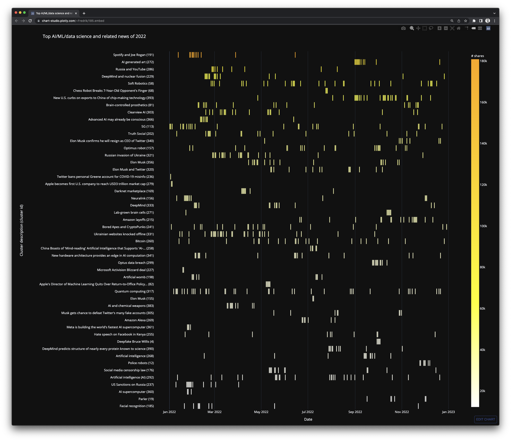

# metacurate-regularly: clustering of news headlines.

**TL;DR:** This repository contains an experiment for **embedding** and **clustering** news headlines, as well as for
**describing** the resulting clusters, and **plotting** them on a timeline.

The screenshot below shows the output of the clustering exercise: the top 50 news in 2022 regarding AI,
machine learning, data science, and related fields based on data collected by [metacurate.io](https://metacurate.io).
Here is the [live graph](https://chart-studio.plotly.com/~Fredrik/185.embed) showing the top 50 news stories, and here
is a [list of the 200 top stories](data/output/2022_1/README.md), including all constituent headlines.




In 2022, my hobby project [metacurate.io](https://metacurate.io) collected 54k+ news items from sources
related to artificial intelligence, machine learning, natural language processing, data science, and other tech
news. This repository contains code for experimenting with the clustering of headlines, and describing the clusters.

The input data is available in [data/metacurate_news_2022.csv](data/metacurate_news_2022.csv). Example output
is available in [data/output/2022_1/](data/output/2022_1/). The output folder contains:

* A copy of the configuration file used for generating the output, e.g.,
[metacurate_news_2022_1.json](data/output/2022_1/metacurate_news_2022_1.json).
* A copy of the CSV file containing the data used for creating the visualization, e.g.,
[cluster_viz_data.csv](data/output/2022_1/cluster_viz_data.csv).
* A local file containing the visualization as seen in the screenshot above, e.g.,
[metacurate_news_viz_2022.html](data/output/2022_1/metacurate_news_viz_2022.html).
* A list of the top N news clusters, e.g., [README.md](data/output/2022_1/README.md).


## Installation with virtualenv

Requirements:

* git
* python 3.9 or newer (it might work with earlier versions, but it has not been tested)
* pip
* virtualenv
* An API key from Cohere
* Optional: Plotly Chart Studio credentials

Set up and activate a virtual Python environment by executing the following commands at a terminal prompt:

```bash
mkdir ~/venv
virtualenv -p python3 ~/venv/metacurate-regularly/
source ~/venv/metacurate-regularly/bin/activate
```

Clone the source code to your local machine and install its dependencies:

```bash
git clone git@github.com:fredriko/metacurate-regularly.git
cd metacurate-regularly
pip install -r requirements.txt
```

### Get and set up a Cohere API Key

In order to use [Topically](https://github.com/cohere-ai/sandbox-topically) to describe the clusters,
you need to have an API key from [cohere](https://cohere.ai/). Get an API key by following the instructions in the
Topically repository. Take note of the key, and set the environment variable `COHERE_API_KEY` like so:

```bash
export COHERE_API_KEY=<your_key>
```


### Optional: Get and set up Plotly Chart Studio credentials

In order to publish the generated Plotly plot to the web (Plotly Chart studio), you need to
have an account and set up the credentials locally. Follow the instructions for getting an
account
[here](https://jennifer-banks8585.medium.com/how-to-embed-interactive-plotly-visualizations-on-medium-blogs-710209f93bd)
and edit the file [set_up_plotly_credentials.py](src/set_up_plotly_credentials.py) to include
your `username` and `api_key`.

Run the file:

```bash
python src/set_up_plotly_credentials.py
```

to generate and store the credentials. This only has to be done once.

## Run the code

To run the code, simply issue the following:

````bash
python main.py -c configs/metacurate_news_2022_1.json
````

NOTE that this is a long-running process: the vectorization step will take a long time if you're running on a CPU,
and the clustering takes quite some time too.
